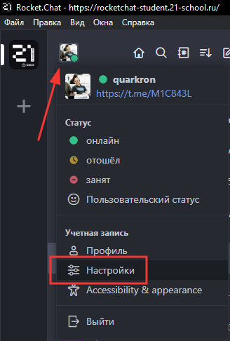
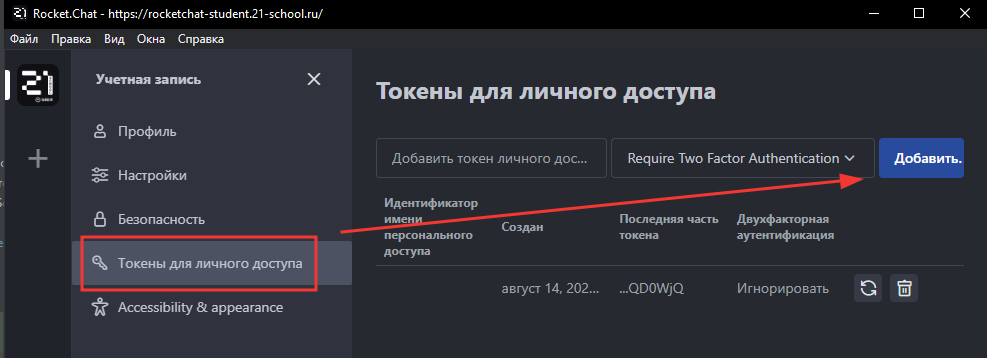
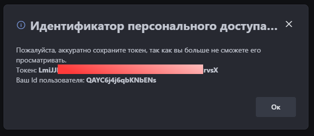

# School21 RocketChat QR-code Extraction Service

Данный сервис позволяет с помощью токена авторизации получить сообщение с изображением от бота генерации qr-кодов для входа в кампус.

Используется:
- **Java Development Kit (JDK):** Комплект для разработки на Java.
- **Apache Maven:** Система управления проектами и сборки для Java.
- **Docker:** Платформа для контейнеризации приложений.
- **Docker Compose:** Утилита для управления многоконтейнерными Docker-

Запуск сервиса в докер-контейнере

```bash
./build_and_run_docker.sh
```

Далее по адресу необходимо отправить POST запрос с токеном из рокетчата
```
http://localhost:8080/api/qr
```

Как получить токен авторизации в рокетчате

1. Заходим в настройки профиля<br>


2. Переходим в раздел "Токены для личного доступа" и нажимаем "Добавить"<br>


3. В появившемся окне копируем токен авторизации<br>

